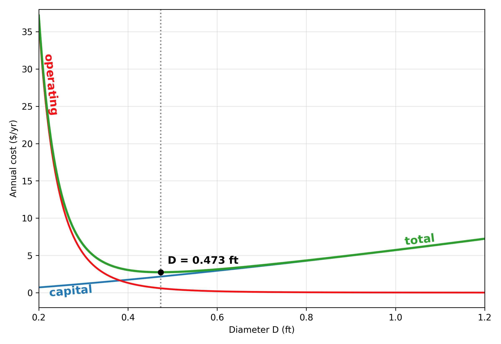

# The Problem

This is Exercise 13.1 from Edgar, Himmelblau & Lasdon. The setup is a
hydrocarbon piping system between two points at the same elevation. You know
the fluid (its density and viscosity), how much of it has to move per second,
and how far it travels. The one thing you choose is the pipe diameter.

That single choice pushes two costs in opposite directions:

- A wider pipe costs more to buy and install. The book models this as C1·D^1.3.
- A wider pipe also slows the fluid down, which cuts friction and pressure
  drop, so the pump uses less electricity. Pumping cost falls as the pipe grows.

The cost of the pump itself is left out, since it's small next to the running
cost over the life of the line.

On paper there are four unknowns: diameter, velocity, pressure drop, and the
friction factor. But three physical relations tie them together: a mechanical
energy balance for the pressure drop, the continuity equation linking velocity
to flow rate, and the Blasius correlation linking the friction factor to the
Reynolds number. Four unknowns, three equations, one degree of freedom. So
everything can be written in terms of diameter alone.

## The solution

Substitute the three relations into the cost equation and total annual cost
becomes a function of one variable, D. From there it's plain calculus: take
the derivative dC/dD, set it to zero, solve. The slope of a curve is flat at
its lowest point, so zero slope marks the minimum. Out comes a clean formula
for the optimal diameter, and the pipe length L cancels out completely.

The formula also shows what matters. Density and flow rate move the answer the
most; the cost coefficients and viscosity barely touch it. Double the flow and
the best diameter grows by roughly 1.4x. For the book's numbers (50 lb/s of a
liquid near the density of water) the optimum is 0.473 ft, or 5.7 inches. The
nearest standard size is a 6-inch pipe, where the fluid runs at about 4.2 ft/s.



## How the code works

Two functions carry the whole thing.

`total_cost(diameter)` is the model. You hand it a diameter in feet and it
gives back the yearly cost in dollars. Inside, it walks the same physics chain
the textbook lays out: from diameter to velocity, then the Reynolds number,
then the friction factor, then the friction loss. The last two lines add the
two costs, pipe and pump, and return the sum. This is the function everything
else leans on.

`make_plot(diameter_opt)` is just the picture. It sweeps a range of diameters,
calls `total_cost` across them, and draws the capital, operating, and total
curves, with a marker on the optimum.

The actual solving is one line. SciPy's `minimize_scalar` takes `total_cost`
and searches it for the lowest point, returning the diameter that costs the
least. No formula, no derivative by hand. The optimizer pokes at the cost
function until it finds the bottom, which is exactly what you'd want when the
model grows too messy to solve on paper.

## Why Python?

Chemical engineering runs on calculation. For a long time that meant a chart
in a handbook or a formula you could solve by hand. Those still work, but only
for the clean cases. Real plants have fittings, fouling, constraints, and
equations that don't rearrange nicely.

## Running it

```bash
pip install -r requirements.txt
python pipe.py
```

## Reference

Edgar, T.F., Himmelblau, D.M., Lasdon, L.S. *Optimization of Chemical
Processes*, 2nd ed., McGraw-Hill, 2001. 

