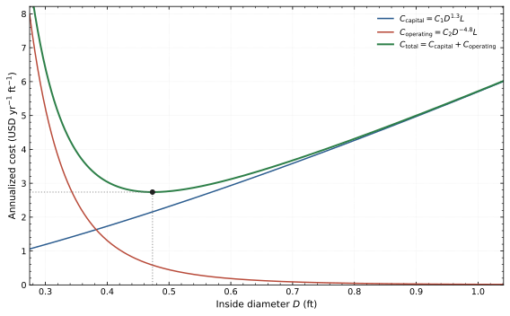

# Economic Pipe Diameter Optimization

This repository models the economic pipe diameter selection problem formulated in Chapter 1, Section 1.3 of *Optimization of Chemical Processes* (Edgar, Himmelblau & Lasdon, 2nd ed., McGraw-Hill, 2001). The model balances capital investment in pipe material against lifetime pumping energy costs for a fluid transport line.

## Problem Formulation

Selecting a pipeline diameter introduces competing cost mechanisms:

1. **Capital cost.** Larger pipes cost more to buy, fabricate, and install. Edgar et al. model annualized installed pipe cost as an empirical power law:
   $$C_{\text{capital}} = C_1 D^{1.3} L$$
   where $D$ is the pipe inside diameter (ft), $L$ is the pipeline length (ft), and $C_1 = 5.7$, carrying units of `USD/(ft^2.3 * yr)` so that the product comes out in USD per year.

2. **Operating cost.** Larger diameters give lower velocities for a fixed mass throughput, which lowers frictional head loss and so lowers pump electricity demand:
   $$C_{\text{operating}} = \left(\frac{C_o}{\eta g_c}\right) \dot{m} F$$
   where $C_o = 0.5938$ in `USD/yr` per `ft*lbf/s` of pump shaft power, $\eta = 0.60$ is pump efficiency, $\dot{m}$ is mass flow rate ($\text{lb/s}$), $g_c = 32.174\ \text{lb}_m\cdot\text{ft}/(\text{lb}_f\cdot\text{s}^2)$, and $F$ is the frictional energy loss per unit mass ($\text{ft}^2/\text{s}^2$).

### Governing Hydraulic Relations

Mass conservation relates mass flow to velocity $v$:
$$v = \frac{4\dot{m}}{\pi \rho D^2}$$

The Reynolds number sets the flow regime:
$$Re = \frac{\rho v D}{\mu} = \frac{4\dot{m}}{\pi \mu D}$$

Above the transition the source text uses an empirical smooth-pipe correlation for the Fanning friction factor:
$$f = 0.046\,Re^{-0.2} \qquad (Re \ge 2100)$$

Below it, the exact Hagen–Poiseuille result applies:
$$f = \frac{16}{Re} \qquad (Re < 2100)$$

The source text switches between the two correlations at a fixed Reynolds number instead of modelling the transition region, and this model keeps that behaviour. The two forms differ by about 30% at $Re = 2100$ (0.0076 against 0.0100), so the friction factor and the total cost jump at the switch. For the baseline parameters the optimum sits at $Re \approx 2.0 \times 10^5$, far above the switch, so the jump does not reach the result.

Frictional dissipation over a line of length $L$ is:
$$F = \frac{2 f L v^2}{D}$$

Substituting $v \propto D^{-2}$ and $f \propto D^{0.2}$ gives the inverse power dependence:
$$C_{\text{operating}} = C_2 D^{-4.8} L$$

For the baseline case $C_2 \approx 0.01610$, in units of `USD * ft^3.8 / yr`.

### Analytical Solution & Length Invariance

The total annualized cost combines both terms:
$$C_{\text{total}}(D) = C_1 D^{1.3} L + C_2 D^{-4.8} L$$

Differentiating with respect to $D$ and setting the derivative to zero:
$$\frac{dC_{\text{total}}}{dD} = 1.3 C_1 D^{0.3} L - 4.8 C_2 D^{-5.8} L = 0$$

Length $L$ divides out of both terms, so the optimum diameter does not depend on how long the line is. Collecting the powers of $D$ gives $D^{0.3 + 5.8} = D^{6.1}$, hence:
$$D^* = \left(\frac{4.8 C_2}{1.3 C_1}\right)^{\frac{1}{6.1}}$$

For the baseline parameters ($\dot{m} = 50.0\ \text{lb/s}$, $\rho = 60.0\ \text{lb/ft}^3$, $\mu = 6.72 \times 10^{-4}\ \text{lb/(ft}\cdot\text{s)}$):

- Analytical optimum: $D^* = 0.4733\ \text{ft} \approx 5.68\ \text{in}$
- Optimal fluid velocity: $v^* = 4.74\ \text{ft/s}$
- Minimum annualized cost: 2.74 USD/yr per ft of line
- Nearest commercial standard: Schedule 40 6-inch nominal pipe (inside diameter $6.065\ \text{in} \approx 0.5054\ \text{ft}$)

The notebook checks the closed form against a bounded numerical minimization; the two agree to within $10^{-4}$ ft.



**Figure 1.** Annualized capital, operating, and total cost against pipe inside diameter, for the baseline parameters. Costs are per foot of line, since the default `pipe_length` is 1.0 ft. The marked point is the optimum, $D^* = 0.473$ ft.

## Repository Structure

- `pipe.ipynb` — the `Pipe` model, the cost plot, and the verification suite, in one self-contained notebook.
- `pipe_plot.svg` — vector plot of the capital, operating, and total cost curves, regenerated by the notebook.
- `requirements.txt` — minimum versions for numpy, scipy, matplotlib, and the Jupyter packages needed to run the notebook.
- `LICENSE` — MIT.

## Installation

```bash
git clone https://github.com/Nuran614/Pipe-Diameter-Optimization.git
cd Pipe-Diameter-Optimization
python3 -m venv .venv
source .venv/bin/activate
pip install -r requirements.txt
```

## Usage

Open the notebook:

```bash
jupyter notebook pipe.ipynb
```

Or run it end to end from the terminal:

```bash
jupyter nbconvert --to notebook --execute --inplace pipe.ipynb
```

Either path solves the trade-off, writes `pipe_plot.svg`, and runs six checks: the solver against the closed form, length invariance, the laminar branch, capital + operating = total, vectorized against scalar evaluation, and rejection of non-positive diameters.

## References

- Edgar, T. F., Himmelblau, D. M., & Lasdon, L. S. (2001). *Optimization of Chemical Processes* (2nd ed., Section 1.3). McGraw-Hill.
